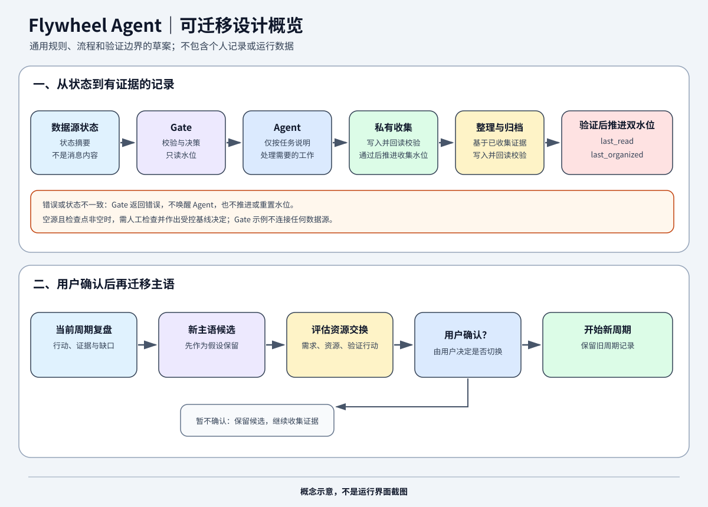

# Flywheel Agent — 可迁移设计草案

Flywheel Agent 是一套围绕真实行动、证据复盘和可复用经验设计的 Agent 工作方法。草案把通用规则、Gate 决策示例、双水位流程和主语迁移模板分开说明，方便人或其他 Agent 阅读、讨论和后续适配。

它适合希望保留个人自主权、让成长流程可交接或更换运行平台的用户，以及需要理解这类 Agent 边界与流程的开发者。它不是开箱即用的完整系统，不含个人记录，也不会连接数据源或控制当前生产环境。

## Quick Start

已在 Python 3.12.10 上运行演示和测试；其他 Python 版本尚未验证。演示仅使用 Python 标准库，不需要安装依赖。

在仓库根目录运行：

~~~sh
python examples/run_demo.py
~~~

命令会打印新建的临时输出目录，并演示 Gate 判断、合成 Markdown 收集、回读验证、推进 `last_read`、生成确定性整理结果、回读验证、推进 `last_organized`，以及再次 Gate 判断为无变化。演示输出不会写入或覆盖仓库文件及用户已有文件。

运行演示测试：

~~~sh
python -m unittest discover -s tests
~~~

## 快速阅读路径

1. [项目概览](docs/OVERVIEW.md)：理解飞轮概念、运行循环与主语迁移。
2. [Agent 通用边界](docs/AGENT_CORE.md)：查看证据、用户决定权和隐私规则。
3. [Gate 与双水位说明](docs/NIGHTLY_GATE.md)：了解输入状态、决策顺序和错误处理。
4. [兼容性矩阵](docs/PLATFORM_COMPATIBILITY.md)：区分已有环境记录与未验证能力。
5. [迭代记录规范](docs/ITERATION_RECORDING.md) 和 [主语迁移模板](templates/SUBJECT_MIGRATION.md)：查看后续记录方式。

运行 Gate 示例的内置自测：

~~~sh
python templates/gate_protocol.py --self-test
~~~

该示例只对传入的状态对象作校验和决策，不连接 WDA、微信或其他数据源。

## 当前状态

- 这是可迁移设计草案和示例，不是可直接部署的完整系统。
- Gate 示例的内置自测覆盖正常决策与错误情形；这不验证生产 Gate、数据连接、调度或无人值守运行。
- 现有运行环境的能力只按前置盘点报告记录；此草案没有重新验证那些运行链。
- Qoder CN 和其他替代平台仍未验证，不能视为已支持。
- 主语迁移只有在用户确认后才开始。若数据源为空但检查点非空，Gate 报错并要求人工检查，不自动唤醒 Agent 或重置水位。
- 本仓库已公开，许可为 MIT License；这里的内容仍是设计草案，存储迁移尚未实现或验证。
- Quick Start 是确定性合成示例，不调用 AI，不连接真实数据源，也不验证真实平台兼容性；它不能恢复用户的私人飞轮状态。

## 来源与隐私边界

通用规则和流程由用户与 AI 协作整理。草案不包含真实聊天、生产截图、账号标识、本机路径、私人主语或运行数据。文件来源及草案许可状态见 [公开文件清单](PUBLIC_ALLOWLIST.md)。
